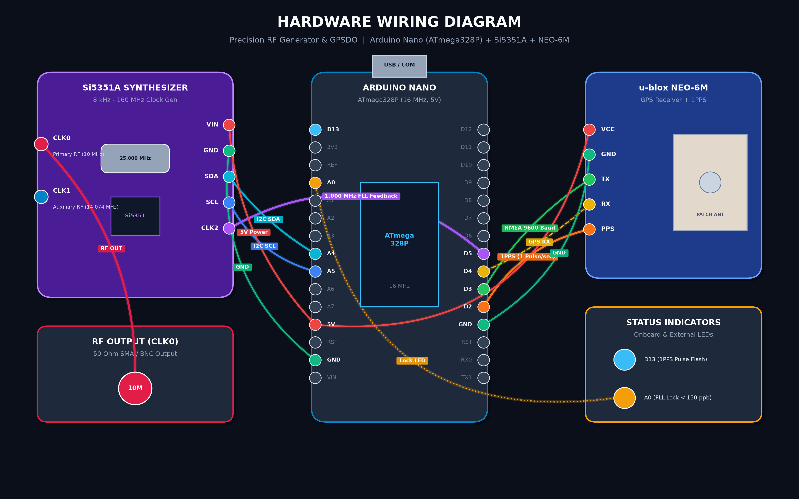
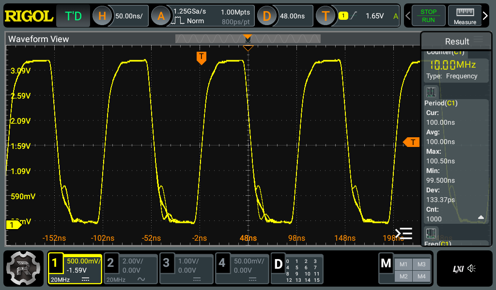
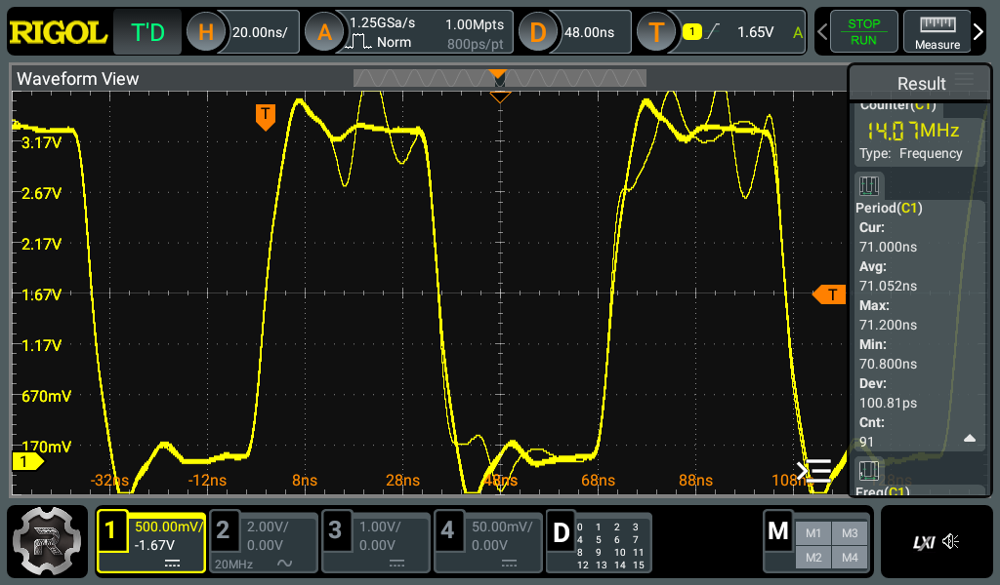

# Precision RF Generator & GPSDO (Si5351A + Arduino Nano + NEO-6M)

[](https://www.arduino.cc/)
[](https://www.microchip.com/)
[](LICENSE)
[](https://github.com/artema0g/Si5351-RF-Generator)

A high-precision, lab-grade RF signal synthesizer and **GPS-Disciplined Oscillator (GPSDO)** covering **8 kHz to 160 MHz** using an **Arduino Nano (ATmega328P)**, **Silicon Labs Si5351A**, and a **u-blox NEO-6M GPS** module.

The system implements a closed-loop **Frequency Locked Loop (FLL)** using the GPS **1PPS (Pulse Per Second)** timebase and the ATmega328P's hardware Timer1 counter. It measures crystal offset in **parts-per-billion (ppb)** and continuously disciplines the Si5351 to cancel out temperature drift and manufacturing tolerance, achieving stability better than **0.05–0.1 ppm** (< 50–100 ppb).

---

## 🌟 Key Features

* **Wide Frequency Coverage**: 8 kHz to 160 MHz with 1 Hz tuning steps.
* **Dual Independent RF Outputs**:
  * **CLK0 (Primary)**: Precision lab bench output / master reference clock (Default: 10.000 000 MHz).
  * **CLK1 (Auxiliary)**: Secondary configurable RF output (Default: 14.074 000 MHz — 20m FT8).
* **Hardware-Gated Frequency Auto-Calibration (FLL)**:
  * **CLK2** outputs a 1.000 000 MHz test signal routed directly into the Arduino's 16-bit Timer1 hardware counter (Pin D5 / T1).
  * The GPS **1PPS** signal triggers an external hardware interrupt (Pin D2 / INT0) to gate the counter over 1s, 10s, or 40s integration windows.
  * Real-time calibration correction factor in **ppb** is continuously computed and fed into the Si5351 PLL registers.
* **Dual Operating Modes**:
  * **Continuous GPSDO Tracking**: Active background disciplining against GPS time.
  * **Manual / One-Shot Calibration**: Run on demand via `cal` command and freeze settings.
* **Zero-Allocation Lightweight NMEA Parser**:
  * Decodes `$GPRMC` and `$GPGGA` sentences without heavy external libraries.
  * Provides UTC time, date, 3D fix lock status, visible satellite count, and HDOP.
  * Built-in Maidenhead Grid Locator (QTH locator) computation.
* **Interactive CLI over USB Serial (115200 baud)**:
  * Simple terminal command prompt for frequency changes, drive strength adjustments, status queries, and manual calibration.
* **EEPROM Persistence**:
  * Store and restore user frequencies, channel states, drive strengths, and calibration constants with CRC protection across reboots.

---

## 🔌 Hardware Wiring Diagram



### Pin Connection Table

| Module | Module Pin | Arduino Nano Pin | Notes / Description |
|---|---|---|---|
| **Si5351A** | VIN / VCC | **5V** (or 3.3V) | Power supply (for boards with 3.3V LDO regulator) |
| | GND | **GND** | Ground |
| | SDA | **A4** | Hardware I2C Data |
| | SCL | **A5** | Hardware I2C Clock |
| | CLK0 | SMA / BNC 1 | Primary RF output (50 $\Omega$) |
| | CLK1 | SMA / BNC 2 | Auxiliary RF output |
| | **CLK2** | **D5 (T1)** | **1.000 MHz reference signal for hardware counter** |
| **NEO-6M** | VCC | **5V** | Power supply (onboard 3.3V LDO) |
| | GND | **GND** | Ground |
| | **PPS** | **D2 (INT0)** | **1PPS pulse input (hardware interrupt)**. Connect to `PPS` header or `TP` pad |
| | TX | **D3** | GPS NMEA output $\rightarrow$ Arduino RX |
| | RX | **D4** | Arduino TX $\rightarrow$ GPS RX (optional) |
| **LEDs** | Built-in | **D13** | Flashes synchronously with each 1PPS pulse |
| | LOCK (opt.) | **A0** | Lights up when frequency lock error is $\le 150$ ppb |

> [!IMPORTANT]
> To enable hardware auto-calibration, ensure that **CLK2** on the Si5351 is wired directly to **D5** on the Arduino Nano.

> [!TIP]
> **Locating the 1PPS / TIMEPULSE Pin on NEO-6M Modules**:
> * **5-Pin Modules**: The `PPS` pin is readily available as the 5th pin on the main header.
> * **4-Pin Modules (e.g., GY-NEO6MV2)**: The main header only exposes `VCC`, `RX`, `TX`, and `GND`. The 1PPS signal is routed to an unpopulated circular solder pad labeled **`PPS`** or **`TP`** (*TimePulse*), connected directly to Pin 3 of the u-blox chip. If no pad is present, you can solder directly to the trace/anode of the onboard PPS status LED.
> * **Logic Level Compatibility**: The 3.3V CMOS output from the u-blox TIMEPULSE pin directly triggers the ATmega328P `INT0` input (logic HIGH threshold $\ge 3.0\text{V}$ at 5V $V_{CC}$), requiring no level shifters or voltage dividers.
> * **3D Fix Requirement**: The 1PPS pulse and the onboard PPS LED will only activate once the GPS acquires a valid satellite fix (typically 30–90 seconds near a window).

---

## 🚀 Getting Started

### Method 1: Arduino IDE
1. Open the Arduino IDE Library Manager (*Sketch $\rightarrow$ Include Library $\rightarrow$ Manage Libraries...*).
2. Search for and install **Etherkit Si5351** (by Jason Milldrum).
3. Open `Gen_Si5351.ino`.
4. In the **Tools** menu:
   * **Board**: `Arduino Nano`
   * **Processor**: `ATmega328P` (or `ATmega328P (Old Bootloader)` for clone boards).
   * **Port**: Select your Arduino COM port.
5. Click **Upload**.
6. Open **Serial Monitor** at **115200 baud** with line ending set to `Both NL & CR` or `Newline`.

### Method 2: PlatformIO (VS Code / CLI)
A pre-configured `platformio.ini` is included. Simply clone the repository and run:
```bash
pio run --target upload
pio device monitor -b 115200
```

---

## 💻 CLI Commands (USB Serial at 115200 baud)

All commands are case-insensitive.

| Command | Description | Example |
|---|---|---|
| `status` | Print full system status: GPS, sats, UTC, FLL, channel frequencies | `status` |
| `freq <clk> <hz>` | Set frequency on channel 0 or 1 (8000 to 160000000 Hz) | `freq 0 10000000`<br>`freq 1 14074000` |
| `out <clk> <on/off>` | Turn channel output ON or OFF (0, 1, or 2) | `out 0 on`<br>`out 1 off` |
| `drive <clk> <mA>` | Set output drive strength: `2`, `4`, `6`, or `8` mA | `drive 0 8` |
| `cal [sec]` | Run an immediate one-shot calibration cycle (default: 10s) | `cal 10` |
| `fll <on/off>` | Enable/disable continuous background GPSDO disciplining | `fll on` |
| `corr <ppb>` | Manually set Si5351 crystal correction factor in ppb | `corr 38450` |
| `xtal <hz>` | Set Si5351 nominal crystal frequency (25000000 or 27000000) | `xtal 25000000` |
| `save` | Save all current settings and calibration factor to EEPROM | `save` |
| `load` | Reload saved configuration from EEPROM | `load` |
| `reset` | Reset all settings to factory defaults | `reset` |
| `help` or `?` | Print list of all available commands | `help` |

---

## 📊 Example `status` Output

```text
================= SYSTEM STATUS =================
GPS Status     : 3D FIX (LOCKED) | Sats: 10 | HDOP: 0.8
UTC Time/Date  : 12:45:02  01.09.2026  QTH: KO85we
1PPS Signal    : ACTIVE (Pulses: 489)
-------------------------------------------------
FLL Engine     : LOCKED (Disciplined) | Auto-discipline: ON (GPSDO)
Si5351 XTAL    : 25 MHz | Current correction: 38450 ppb (38.450 ppm)
FLL Measured   : 1000000 Hz (error: 8 ppb) [Gate: 22/40 s]
-------------------------------------------------
CLK0 (Primary) : [ON] 10.000 000 MHz (Drive: 8mA)
CLK1 (Aux)     : [OFF] 14.074 000 MHz (Drive: 8mA)
CLK2 (FLL Ref) : [ON] 1.000 000 MHz -> D5 Counter Input
=================================================
```

---

## 🔬 How FLL Disciplining Works

1. **Reference Frequency Generation**:
   The Si5351 synthesizes a 1.000 000 MHz square wave on `CLK2`.
2. **Pulse Counting**:
   The ATmega328P 16-bit Timer1 is configured in asynchronous external counter mode, incrementing on every rising clock edge on pin `D5`.
3. **1PPS Synchronization**:
   The NEO-6M generates an atomic-accurate pulse every second upon GPS 3D fix. When the interrupt on pin `D2` triggers, the counter value and overflow registers are captured with negligible latency.
4. **Error Calculation**:
   Over an integration gate ($N = 10\text{ s}$ or $40\text{ s}$), expected count is $N \times 1\,000\,000$. The tick error $\Delta$ directly yields the fractional frequency offset:
   $$\Delta_{\text{ppb}} = \frac{\Delta \times 10^3}{N}$$
5. **Closed-Loop Correction**:
   The correction is applied via `si5351.set_correction()`, which recalculates the PLL multipliers in hardware, steering the output back to zero error.

---

## 🔬 Laboratory Verification & Oscilloscope Measurements

The output RF signals and disciplining accuracy were verified using a calibrated **Rigol DHO924 (12-bit High-Resolution Oscilloscope, 250 MHz, 1.25 GSa/s)** connected directly via LAN SCPI interface.

### 1. Master Reference Clock: 10.000 000 MHz (CLK0)


* **Mean Period ($T_{\text{avg}}$)**: **`100.00 ns`** ($\equiv \mathbf{10.000\,000\text{ MHz}}$) across 1,000 continuous sweeps.
* **RMS Jitter ($\sigma / \text{Dev}$)**: **`133.37 ps`** (matches Silicon Labs MultiSynth specification).
* **Peak-to-Peak Deviation**: $99.50\text{ ns} - 100.50\text{ ns}$ ($\pm 500\text{ ps}$).
* **Hardware Counter**: **`10.00 MHz`**.

### 2. Auxiliary FT8 Output: 14.074 000 MHz (CLK1)


* **Mean Period ($T_{\text{avg}}$)**: **`71.052 ns`** (Theoretical for 14.074000 MHz: $71.053\text{ ns}$, error: **$< 1\text{ ppm}$** / $< 14\text{ Hz}$).
* **RMS Jitter ($\sigma / \text{Dev}$)**: **`100.81 ps`**.
* **Hardware Counter**: **`14.07 MHz`**.

### Measurement & Probing Tips
* **Drive Strength**: Setting output drive to **`2 mA`** (`drive <clk> 2`) significantly reduces edge ringing and overshoot on breadboard interconnects compared to 8 mA.
* **Ground Spring**: For frequencies above 10 MHz, use the short ground spring contact supplied with your probe instead of the standard 12 cm alligator ground lead to eliminate inductive ground-loop resonance (~145 MHz).

---

## 💡 Practical Recommendations

* **GPS Antenna**: The NEO-6M requires a clear view of the sky (place near a window for initial testing). The onboard PPS LED on the NEO-6M will only start blinking once a valid 3D GPS fix is acquired.
* **Power Supply**: Si5351 output buffers draw up to 50–80 mA under load. Use a clean USB power supply or external 5V regulator with adequate decoupling capacitors (100–470 $\mu$F) across 5V and GND.
* **Crystal Selection**: Most generic purple Si5351 boards have a 25 MHz crystal. If your board uses a 27 MHz crystal, type `xtal 27000000` in the serial terminal and save with `save`.

---

## 📄 License

This project is licensed under the [MIT License](LICENSE).
